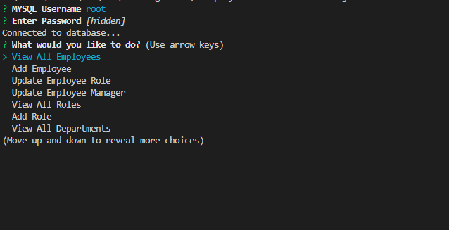
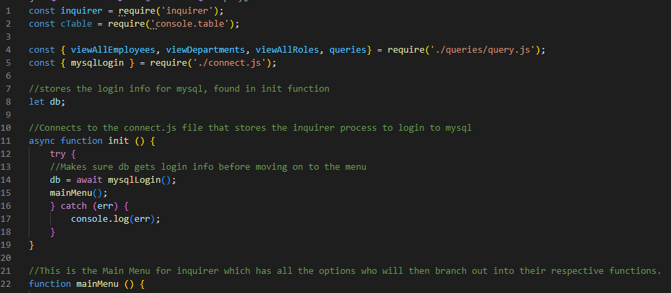
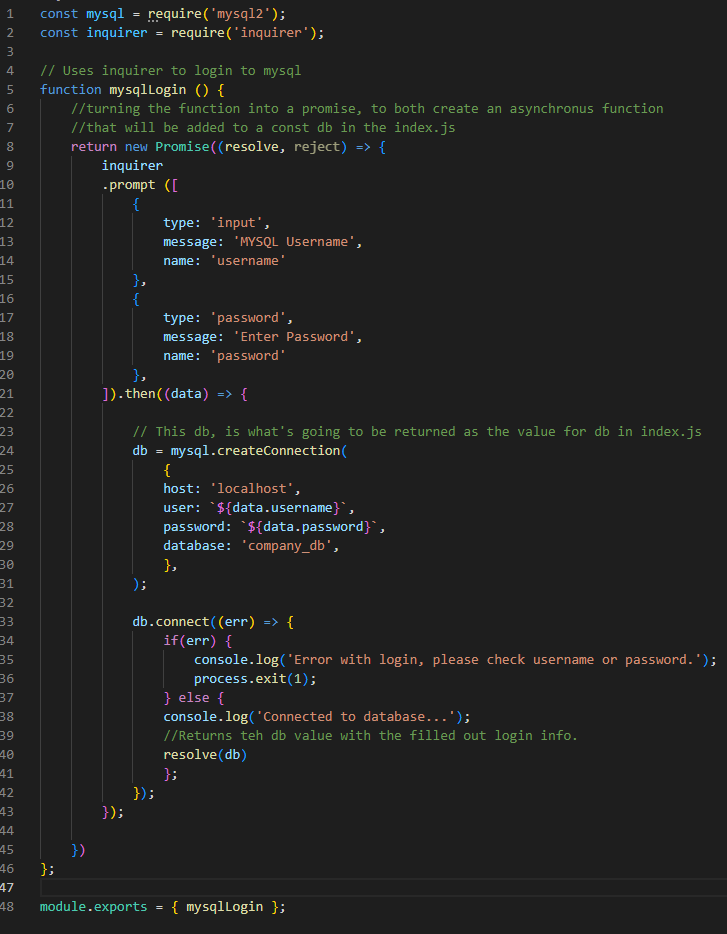
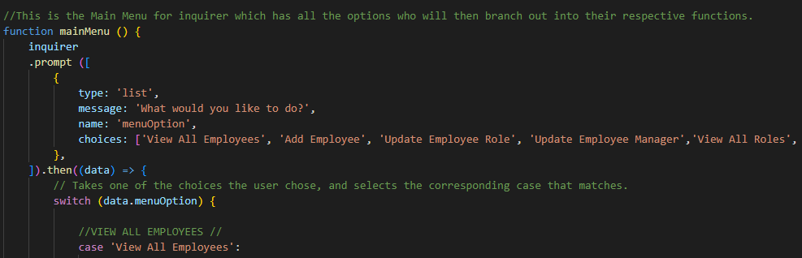
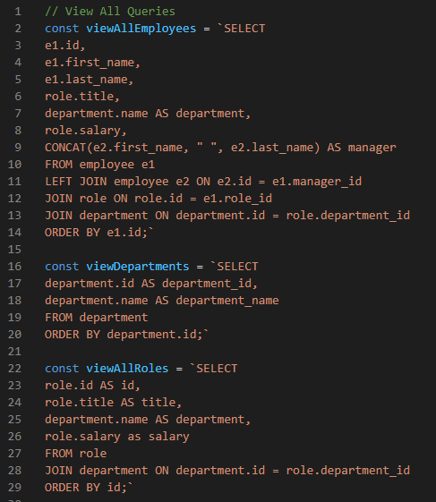
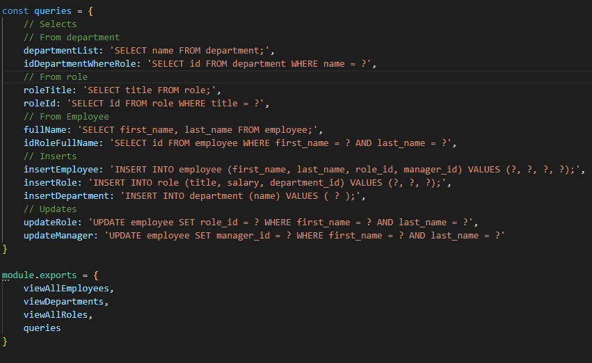

# 12 SQL: Employee Tracker


## Video Demonstration

[Video Demonstration](https://drive.google.com/file/d/1wcbc-mJIQpUQTKJeY6ovEXMhu9vWCy1W/view)

## How to Run

To begin running the application. Login to your mysql, then you'll need to create the database, by running the schema.sql file in the db folder.
The seeds.sql isn't necessary for this, it's more for testing purposes.
after the databse has been succesfully created.
Run 'node index.js'

You'll then be prompted for a login to mysql, which then after a succesfull login, the main menu will be presented.

## Task

My task was to create a employee tracker using mysql, and inquirer that will prompt the user with questions relating to adding a department, role, and employee. Based
on their responses, the database created with mysql will then be populated.

## Code Breakdown

The application stars with a prompt that asks the user for their username and password that will be used to connect to the database.
The index.js file only contains the code to initialize the login.



The connect.js fil carries the actual code that will be used to login, into mysql.
This connects us to mysql, and also connects us to the company_db database.



After the user has logged in, they will then be taken to the main menu. from there the user can pick and choose, what option they want to take.
The main menu is using a switch method to move to different parts of the code, based on what option the user has chosen.
The menu for the application can be seen at the top of this README



All the queries that are being used for the query functions, are being housed in the queries/query.js file
Here all the queries are exported and organized based on what their functionality is suppose to be
This first set of queries are for the tables themselves for when the user asks to view all.



This second set of queries being put into an object makes for seeing which are queries in the index.js file
due to them being exported as queries. So that when they are called in the index it would be something like this 

db.query(queries.fullname, (err, res) => console.log(res))



For now the code has comments written all over them to explain what is happening.

## User Story

```md
AS A business owner
I WANT to be able to view and manage the departments, roles, and employees in my company
SO THAT I can organize and plan my business
```

## Acceptance Criteria

```md
GIVEN a command-line application that accepts user input
WHEN I start the application
THEN I am presented with the following options: view all departments, view all roles, view all employees, add a department, add a role, add an employee, and update an employee role
WHEN I choose to view all departments
THEN I am presented with a formatted table showing department names and department ids
WHEN I choose to view all roles
THEN I am presented with the job title, role id, the department that role belongs to, and the salary for that role
WHEN I choose to view all employees
THEN I am presented with a formatted table showing employee data, including employee ids, first names, last names, job titles, departments, salaries, and managers that the employees report to
WHEN I choose to add a department
THEN I am prompted to enter the name of the department and that department is added to the database
WHEN I choose to add a role
THEN I am prompted to enter the name, salary, and department for the role and that role is added to the database
WHEN I choose to add an employee
THEN I am prompted to enter the employee’s first name, last name, role, and manager, and that employee is added to the database
WHEN I choose to update an employee role
THEN I am prompted to select an employee to update and their new role and this information is updated in the database 
```